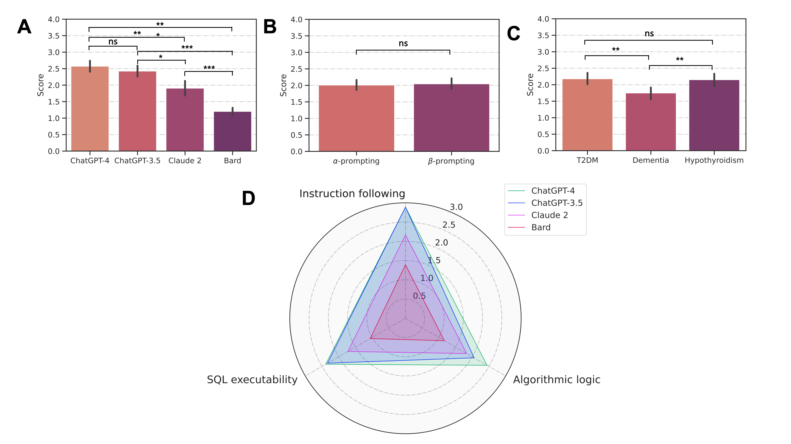

# Large Language Models Facilitate the Generation of Electronic Health Record Phenotyping Algorithms
---
## Overview
---
This repo shares the source codes of analysis, as well as the LLM-generated SQL-formatted phenotyping algorithms.

The result of this work has been made public at arXiv: [Large Language Models Facilitate the Generation of Electronic Health Record Phenotyping Algorithms](https://arxiv.org/abs/xxxx)

### Reference:
*Yan C, Ong H, Grabowska M, Krantz M, Kerchberger E, Su W, Dickson A, Peterson J, Feng Q, Roden D, Stein M, Malin B, Wei WQ. Large Language Models Facilitate the Generation of Electronic Health Record Phenotyping Algorithms . arXiv preprint arXiv.*

### Prompting strategies
SQL files with the suffix "_1" correspond to the alpha-prompting strategy, whereas those with the suffix "_2" correspond to the beta-prompting strategy

